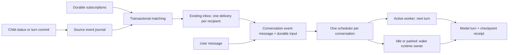

# Run event subscriptions and conversation delivery

Status: core implementation landed in the working tree, 2026-09-09.
See [implementation and rollout notes](run-event-subscriptions.md) for the shipped
contract and compatibility boundaries. This document remains the broader design
for the replacement of `await_session` as the agent supervision interface. It supersedes the subscription, delivery, and wakeup
portions of [agent-events.md](agent-events.md); existing event producers and
platform control events migrate as described below.

## Decision

A run subscribes to facts about other runs. Matching facts become durable event
messages in the subscriber's conversation and schedule model input. Registration
returns immediately. An active supervisor continues its work; a waiting supervisor
is resumed automatically. No agent has to call a wait or polling tool to receive
an event.

Keep Postgres, the existing inbox, the worker channel, and the dispatch pump.
Add explicit subscriptions, an immutable source-event journal, and durable input
and turn receipts. Use one conversation-input scheduler for user messages and
event messages. WebSockets and process notifications accelerate delivery; neither
is its source of truth.

The essential separation is:



## Baseline before implementation

These findings describe the checkout before this implementation, not a production trace.

| Path | Current behavior | Consequence |
| --- | --- | --- |
| `lib/orchestrator-tools.ts`, `await_session` | Reads the source status, arms a timer, writes the caller's park intent; creates no source subscription | Waiting on a run does not itself establish delivery from that run. The tool relies on implicit parent routing and asks the model to end its turn |
| `lib/runs.ts`, `applyStatusTx` / `emitTerminalChildEvent` | Status and telemetry commit together; terminal inbox publication runs afterward, asynchronously, with errors swallowed | A crash can commit completion without publishing the parent's event. The inbox sweep cannot recover an event that was never inserted |
| `lib/worker-channel/event-handler.ts`, `landTerminal` | Writes terminal status, telemetry, timer cancellation, and commit command directly; does not call the child-event publisher or interpret park intent | The channel terminal path bypasses the legacy publication and turn-end policy entirely; fixing only `applyStatusTx` is insufficient |
| `lib/inbox.ts`, `emitInboxEvent` | Uses parent relationships and hard-coded supervisor copies; eagerly mirrors UI messages best-effort | Observation interests are implicit, fan-out is not atomic, and UI visibility is separate from model delivery |
| `lib/worker-channel/snapshot.ts`, `buildRunStart` | Claims inbox events while building the bootstrap snapshot | Events can be marked injected before a worker has accepted model input |
| `lib/worker-runtime/context.ts`, `runModelTurn` and its drivers | Passes the supplied prompt to the backend; does not read `RunStart.inboxDigest` | The WebSocket worker can receive a claimed digest without passing it to the model |
| `lib/worker-runtime/context.ts`, `driveSingleTurn` | Executes one backend turn and proposes finalization | It does not provide an ongoing input loop for active implementation/executor supervisors |
| `lib/worker-channel/snapshot.ts`, `pendingMessages` | Infers pending user input from message IDs after the last agent message | A commentary/output row is not a receipt proving which inputs a turn processed |
| `lib/runs.ts`, `loadPostgresContextMessages`; `lib/agent-backend/postgres-turn.ts` | Excludes inbox mirrors and digest frames from reconstructed context | A transient digest is not durable model history for the next server-runtime turn |
| `lib/extensions/events.ts`, `events__poll` | Claims before the tool result is durably recorded | Claim success alone cannot prove delivery to the model |

The existing `agent_events` telemetry stream remains a UI/debug log. Do not
subscribe agents to raw token deltas, shell output, or SSE connection lifetime.

## Agent-facing contract

### Subscribe, continue, receive

Proposed tools, exposed through the ordinary authenticated control-plane tool
registry and through CodeAct:

```ts
events__subscribe({
  source_run_id: 241,
  events: ["run.attempt_finished", "run.question_opened"],
  attempt: "current",       // positive integer | "current" | "all"
  replay: "current_state", // "current_state" | "future_only"
  lifetime: "attempt",     // "attempt" | "until_unsubscribed"
  keep_open: true,
  client_key: "review-241"
})
// Returns immediately:
// { subscription_id, source_run_id, resolved_attempt, source_revision,
//   status, queued_delivery_ids }

events__unsubscribe({ subscription_id })
events__list_subscriptions({})
```

`source_run_id` is one exact run. Multiple subscriptions cover multiple children;
spawn responses can return a batch. V1 has no arbitrary payload predicates,
user-supplied callbacks, tree wildcards, or executable filters. Resolve `current`
to a concrete attempt while registering. `lifetime: attempt` requires a concrete
attempt and closes when that attempt finishes, after enqueuing its last matching
facts. Reject combinations that cannot have a finite lifetime.

The subscriber is always the authenticated caller's run, never an arbitrary
target supplied by the agent. Agents may observe their own run tree within their
existing resource permissions; cross-tree observation requires a separate explicit
authorization grant. UI/API access uses the owning user's permissions too. Recheck
visibility before materializing a delivery if ownership/access has changed.
Reject self-subscriptions to turn/lifecycle events: a turn-finished message must
not trigger an endless sequence of turns observing their own completion.

`client_key` is required for retryable registration: the same key and identical
normalized parameters returns the same subscription, including after it finishes.
Reusing it with different parameters fails. Creating a new observation after
unsubscribe requires a new key.

Agent-created children get a default supervision subscription **in the same
transaction as child creation**, before dispatch is possible. It covers attempt
completion and questions and keeps the parent open until completion is delivered.
`start_session` and `spawn__spawn_agent` return the subscription ID and attempt.
Explicitly resuming a child similarly creates/renews an observation of the new
attempt atomically with accepting the resume input. A pre-existing persistent
subscription can cover it; overlapping matches still produce one message.

An agent can therefore start several children, continue independent work, and
finish its current response. It does not say `await_session(child)` afterward.
If it has no more work this turn, natural turn completion is enough to yield.
An optional `events__yield` can request an earlier safe yield where the backend
supports it, but correctness never depends on that tool or on obeying text such
as “end your turn now.”

`keep_open` controls run lifetime, not message priority. Explicit subscriptions
default to false; default child supervision sets true. An open persistent
keep-open subscription intentionally keeps a conversation resumable until removed
or explicitly closed. Show it in the UI so indefinite waiting is explainable.

### Events are facts with stable identities

Start with this small platform taxonomy:

| Event | Identity / payload |
| --- | --- |
| `run.attempt_finished` | Exactly one committed outcome per source attempt: completed, failed, cancelled, budget_exhausted; structured result, bounded summary, error category, PR/artifact references |
| `run.turn_finished` | One per committed logical turn; useful for a reply from an ongoing chat child that becomes idle rather than terminal |
| `run.question_opened` | Question ID, attempt, question, deadline, response target; does not close an attempt subscription |
| `run.question_resolved` | Question ID, answered/expired state; prevents a supervisor acting on an obsolete question |
| `run.worker_failed` | Worker generation and diagnostic references; informational unless an attempt also ends |

Use source-neutral names because an event may have several observers. Project
legacy `child.result` / `child.exception` / `child.cancelled` /
`child.budget_exhausted` into the single attempt-finished type during migration.
A worker crash and a failed attempt are different facts; a restarting worker is
not automatically a failed logical attempt. Keep source attempt, logical turn,
and worker generation distinct.

Delivery example:

```json
{
  "type": "run_event",
  "schema_version": 1,
  "event_id": "evt_7c2a",
  "delivery_id": 812,
  "source": { "run_id": 241, "attempt": 3, "revision": 17 },
  "event_type": "run.attempt_finished",
  "occurred_at": "2026-09-09T10:41:00Z",
  "payload": {
    "status": "completed",
    "summary": "Review finished; two changes requested.",
    "result_ref": { "run_id": 241, "attempt": 3 }
  }
}
```

Persist this as a typed conversation message. Render the same message in the UI
and backend prompt with an explicit “Event from run #241, attempt 3” attribution.
Child text is quoted data, never system-policy authority or a human instruction.
If a backend only accepts string user input, render an attributed event envelope
in that input; retain platform origin in storage. Do not call `sendMessageToRun`
pretending the child event was authored by a human.

## Storage and transaction boundaries

Proposed additive schema (names subject to normal migration conventions):

| Table | Required fields and constraints |
| --- | --- |
| `run_source_events` | UUID ID; source run, per-source revision, attempt, optional logical turn and worker generation, type/version, immutable JSON payload, occurred_at, producer_key. Unique `(source_run_id, revision)` and `(source_run_id, producer_key)` |
| `run_event_subscriptions` | UUID ID; subscriber run; source run; normalized types/attempt/lifetime/replay; keep_open; start/end source revisions; active/finished/cancelled; client_key; timestamps. Unique `(subscriber_run_id, client_key)` |
| `inbox_events` (extend) | `source_event_id`, delivery cancellation reason; unique `(target_run_id, source_event_id)` for new events. Keep existing addressing/provenance fields and legacy rows |
| `run_event_delivery_matches` | Delivery ID + subscription ID, unique pair; records every matching interest when subscriptions overlap |
| `agent_messages` (extend) | Nullable unique event delivery ID and typed `run_event` block. One durable UI/model representation per delivery |
| `run_inputs` | UUID ID, target run, run-local input sequence, message ID, kind (`user`/`event`), pending/assigned/completed/cancelled, assigned logical turn, timestamps. Unique message ID and `(run_id, input_seq)` |
| `run_turns` | UUID ID, run ID, turn ordinal, execution state, input manifest, backend resume token before/after, execution generation fence, result/checkpoint receipt, timestamps. At most one active turn per run |

Add partial indexes for active subscriptions by source/attempt, pending deliveries
by target, ready inputs by run/sequence, and unfinished turns by run. Foreign keys
must preserve journal references while deliveries or receipts need them; deletion
of a source is an explicit archival operation, not cascading erasure of another
run's conversation. The existing `inbox_events.run_turn_id` actually references an
`agent_messages` frame; do not reuse it as the new logical turn ID. Add explicit
message/input links and name the legacy field accurately in the migration.

Use run-local sequence allocation under the target run lock. The input sequence
is scheduling order; global message IDs and source-event IDs are not completion
cursors. Source revision is allocated under the source publication lock and is
independent of worker generation and input sequence.

### Publish and register without losing the race

All source publications and subscription mutations acquire a transaction-scoped
advisory lock keyed by source run. Allocate revisions under that lock. Updating
several subscriptions acquires source locks in ascending run-ID order. Status
writers acquire this publication lock before their existing source run row lock;
make this ordering common to every terminal path, including worker receipts.
The channel handler must use a transaction-taking publication primitive inside
its existing receipt transaction; it must never call a helper that opens a nested
transaction. Question open/resolve and turn-completion writers use this same
source-fact publication contract with their state/checkpoint changes.

Within a terminal status transaction:

1. Fence the worker/generation, validate the state transition, and write the
   committed attempt outcome and its immutable result references.
2. Allocate a source revision and insert the canonical event, with a stable
   producer key such as `attempt:3:finished`.
3. Match active subscriptions at that revision. Insert recipient inbox rows and
   delivery-match records using unique constraints for overlap/retries.
4. Finish finite subscriptions after recording their last matches.
5. Commit status, telemetry, source fact, subscriptions, and deliveries together.

Do not read a mutable run later to construct an old attempt's event. If the
result is large, persist the immutable artifact reference before finalization;
bounded summary and reference must be available in the commit. Publication errors
fail/retry the transaction rather than silently dropping notification.

Within registration, under the same source lock, resolve attempt and capture
revision R. `future_only` begins after R. `current_state` also enqueues canonical
facts representing that attempt's current terminal state and/or still-open
question at R. Thus completion either wins the lock and is replayed, or follows
registration and matches normally. No read-status-then-subscribe gap exists.
Replaying a terminal attempt immediately finishes a finite subscription but
leaves its queued delivery outstanding. This API does not replay arbitrary history.

For this initial bounded use case, materialize recipient inbox rows directly in
the publication transaction. The journal is the immutable fact, the inbox is the
durable delivery queue; a second asynchronous fan-out service is unnecessary.
Do not create target conversation messages or take target scheduling locks here.
That work belongs to the separate materializer below, avoiding source-to-target
run-lock cycles. Existing generation-authority locks remain outermost wherever
required; audit the complete lock hierarchy before changing status writers.

Subscription limits are enforced at registration, never by truncating delivery:
initial limits 100 active subscriptions per subscriber and 100 observers per
source, configurable. A later high-fan-out implementation can use durable routing
jobs and revision-bounded subscription history; it must preserve this contract.

### Materialize one conversation input

A materializer takes the target run's scheduling lock and, in one transaction:

1. Reads bounded pending deliveries; checks target lifecycle and access.
2. Inserts one `agent_messages.run_event` row for each delivery, idempotently.
3. Inserts its `run_inputs` row and allocates a target-local sequence.
4. Marks the delivery materialized with its message/input IDs.

Commit precedes any WebSocket notification or dispatch attempt. An event message
in the UI initially says **queued**, then links to the model turn that received
it. There is no eager best-effort mirror plus a separate ephemeral digest.
Batch several messages into one prompt without creating another transcript copy.

The pump retries pending delivery materialization and unscheduled inputs, not
only parked runs with pending inbox rows. Crashing after materialization but
before dispatch must leave runnable input visible to the sweep.

`unsubscribe` stops future matching after a source revision fence. Already
queued deliveries still arrive by default. A separate `discard_pending: true`
option may cancel deliveries that have no other live matching interest and have
not been assigned to a model turn. It cannot retract input already executing.

## Scheduling and lifecycle

Every runtime follows this matrix:

| Subscriber state | Delivery action |
| --- | --- |
| Active model/backend turn | Queue durably; expose in UI immediately; process at the next safe backend turn boundary |
| Worker alive, between turns | Send ordered input through its existing channel and start the next turn under the same scheduling claim |
| Pending/preparing | Keep input queued and include it in bootstrap; do not start another worker |
| Idle/parked, worker absent | Mark runnable and dispatch through the existing admission/provider machinery |
| Server-runtime mapped conversation | Notify its owning pipe; the pipe uses the same durable input/turn claim, with its pump as recovery |
| Cancelled/closed/completed/failed/budget_exhausted subscriber | Retain undelivered event as suppressed with reason; no automatic resurrection |

The subscription remains attached to the logical run across worker replacement,
SDK resume, and controller reconnect. Explicitly reopening a terminal subscriber
may reactivate persistent subscriptions and queued inputs under existing resume
authorization. A different logical run does not inherit subscriptions silently.

A backend turn here means one `AgentBackend.runTurn` invocation, which may
contain multiple tool/model rounds. V1 queues until that invocation finishes; it
does not abort a tool, splice into an unfinished tool-result exchange, or run a
second concurrent backend invocation. User/control cancellation retains its
existing immediate path. Optional backend-specific steering can reduce latency
later only after adapter tests prove the same ordering and receipts.

The scheduler finalizes each turn while holding the target run lock:

1. Record its checkpoint/result and completed input manifest.
2. Honor explicit cancellation, close, and budget stop first.
3. Schedule another turn if there are ready inputs.
4. Otherwise, park if a finite keep-open subscription is still active **or its
   delivery has not completed a model turn**; persistent keep-open interests also
   park the run.
5. Otherwise apply ordinary idle/completion policy and required PR checks.

The outstanding-delivery clause is essential: a one-shot subscription may finish
matching before its supervisor sees the final event. Natural assistant completion
must not strand that message by completing the supervisor early.

Because fact publication precedes subscription closure atomically, a finalizer
observes either the still-active finite subscription or its outstanding delivery.
Read both conditions in one database statement/snapshot so a subscription finishing
between two independent reads cannot make both conditions appear false.
When the materializer or a human input races with parking, both serialize through
the target scheduling lock; either the turn sees the input or the writer sees a
parked target and marks it runnable. The durable pump covers lost wake hints.
Do not hold database locks while calling models, providers, or tools.

Explicit `report_result`/`raise` requests close the run only through this same
lifecycle gate. If supervision obligations remain, return their IDs and require
the caller to cancel the subscriptions, delegate responsibility, or explicitly
finish with outstanding work. Human cancel/close always wins and records why
remaining inputs were suppressed. This changes the current result-over-parking
precedence deliberately; tests must cover it.
For keep-open interests between runs, reject registrations that would introduce
a cycle in the finite supervision dependency graph, with concurrent checks
serialized by a short graph-mutation lock. Ordinary non-keep-open observations
can be cyclic; they still obey turn budgets and exclude self-notification.

This also requires replacing `driveSingleTurn` with the shared scheduling loop
for task/executor runs: backend turn completion is not necessarily logical run
completion. PR synchronization occurs on actual implementation finalization,
not every supervision turn. A parked implementation must retain its worktree and
resume checkpoint without being forced to open a premature PR.

## Delivery receipts, crash recovery, and model history

Define the observable stages honestly:

- **Published:** source fact and matching recipient deliveries committed.
- **Queued:** event message and input committed in the recipient conversation.
- **Accepted:** the current worker/pipe durably accepted an assigned turn manifest.
- **Turn completed:** a fenced checkpoint/result receipt committed for that
  manifest. This is evidence the turn ran with the event as input, not proof the
  agent understood or acted correctly.

No “handled” acknowledgment tool or timeout exists. An agent's business action
is observable through normal task notes, responses, and causation links.

The control plane assigns a durable turn ID and ordered input manifest before
starting a backend call. Extend `run.start` / `run.input` and worker receipts with
turn/input IDs. Transport ACK means spool acceptance only. Input completion is
written with the logical-turn checkpoint receipt, fenced by current
`(run_id, worker_generation, instance_id)` and controller ownership. Use the same
IDs on channel replay. A stale generation cannot complete the replacement's work.

Replace the worker's transcript-seeded `OrderedInputQueue` high-water assumption
with explicit input-ID dedupe and input-sequence ordering. A row appearing in
bootstrap history does not prove it was processed. Pending inputs come from
`run_inputs`, not “all user rows after last assistant row.”

Resume policy:

| Crash point | Recovery |
| --- | --- |
| Before publication commit | Status and event roll back together; receipt retry is idempotent |
| After publication, before message materialization | Inbox sweep creates the missing message/input |
| After queue commit, before channel send | Input sweep resends or dispatches |
| After worker accepts, before backend starts | Replay the same manifest; accepted is not completed |
| During backend execution, or after backend completion before durable checkpoint receipt | Mark execution uncertain; reconcile available SDK checkpoint evidence. If completion cannot be proven, retry with the stable event/turn identity and an explicit interrupted-turn note |
| After checkpoint receipt commits | Inputs stay completed across worker generations; never schedule that manifest again |

Guarantee exactly one durable recipient message/input per source event and
at-least-once execution under ambiguous backend failure. Do not promise exactly-once
model inference or external side effects. Preserve existing tool-call idempotency;
mutating actions that may repeat after interruption need operation-level keys or
state reconciliation. A channel spool receipt is not an SDK execution receipt.

For SDK-session backends, inject queued events in the input for their assigned
turn; on normal resume, existing SDK history carries completed inputs. If SDK
history is missing, rebuild from durable conversation messages and receipts,
including event messages, rather than replaying only user text. Test each adapter.
For Postgres-backed pi turns, include the canonical event message in reconstructed
history on subsequent turns; remove the blanket event-frame exclusion for the new
message type. Active inputs appear once in the assembled context, not once from
history and again as a prefix. Compaction summaries must retain outstanding child
identities, attempts, questions, and decisions, with links to original messages.

## Boundaries, ordering, and operational behavior

- Order events per source revision; order conversation inputs per subscriber
  sequence. There is no global causal ordering across children. Parent decisions
  re-read authoritative task/run state before taking consequential action.
- Preserve older-attempt facts as history. Tag them with their attempt and current
  source attempt rather than automatically deleting a failure/question because a
  later attempt exists. Following “current” never silently retargets to new work.
- Terminal outcomes and questions are lossless. Exclude progress/token streams
  from default subscriptions. Later opt-in progress can coalesce pending updates
  by source/attempt/type, never across question or terminal boundaries.
- Initial batch cap: 32 event inputs and 32 KiB rendered event text per turn.
  Preserve full source payload/artifact references; truncate displayed summaries
  explicitly. Interleave user inputs in sequence and never move events across
  an intervening user message. Drain further batches in subsequent bounded turns.
- Oversized/malformed events are quarantined with a visible diagnostic; do not
  silently consume them or hot-loop a poisoned subscription. Registration fails
  clearly when limits are exceeded. Backlog saturation alerts an operator;
  successful registration never licenses dropping a terminal event.
- Cancelling an observer subscription does not cancel the child. Cancelling a
  child publishes its final outcome to observers. Platform cancel/budget control
  remains outside LLM subscriptions and cannot be filtered or forged.
- No automatic recursive ancestor copies. Direct supervision is an explicit
  subscription. Retain existing failure escalation during migration, then express
  it as a platform supervision policy with an explicit destination and dedupe.
- PR/CI/task events continue using existing routes in the first rollout. Extend
  subscriptions to explicit task/PR sources afterward; a child's result still
  does not mean its PR merged or a dependent task is ready.
- Pending deliveries/inputs and referenced uncertain turns are never TTL-deleted.
  Retain journal facts for active replay requirements; archive completed history
  under the existing run retention policy. Keep producer-key dedupe tombstones
  for as long as corresponding receipts/webhooks can be replayed. Partitioning is
  an operational follow-up, not a prerequisite for correctness.

Track publish-to-queue latency, queue-to-turn-start latency, oldest ready input,
backlog size, uncertain executions, suppressed deliveries, registration failures,
and rejected stale-generation receipts. Separate queue delay caused by a running
backend turn, admission limits, an offline pipe, and infrastructure failure.
Initial healthy-runtime objective: start queued input within five seconds of a
safe turn boundary when capacity is available; the recovery pump should discover
lost wake hints within its configured interval. These are rollout targets, not
claims about the current system.

## Implementation sequence

1. **Close the verified delivery holes.** Add an end-to-end regression proving a
   snapshot digest reaches the actual backend prompt. Until durable inputs ship,
   preserve claimed digests across snapshot rebuild/restart; simply prefixing the
   string once does not close the crash gap. Make terminal publication transactional
   and include immutable attempt data. Cover all status-write paths.
2. **Journal and subscriptions.** Add schema, source locking/revisions, bounded
   atomic fan-out, tools, authorization, and registration replay. Register default
   child watches in spawn/resume transactions. Keep the public tool rollout gated.
3. **Durable conversation inputs.** Add canonical event messages, input/turn
   records, materializer, receipt-based pending selection, and shared scheduling.
   Migrate user input too so two independent schedulers cannot compete for a run.
4. **Runtime integration.** Wire worker bootstrap, active input loop, receipts,
   server-runtime pipe ownership, SDK reconstruction, keep-open lifecycle, and
   finalization. Negotiate a worker capability for durable event inputs; never
   enable the new contract on a worker bundle that drops the new fields.
5. **Switch agent behavior.** Update executor/concierge personas, spawn and session
   tool descriptions, CodeAct manifest, README/MCP docs, and UI delivery indicators.
   Register children and return; receive attributed event messages. Keep timers
   for real deadlines/watchdogs, not as a prerequisite for receiving completion.
6. **Retire old paths.** Hide `await_session` and destructive `events__poll` from
   new agents. For old sessions, make `await_session` an idempotent finite
   subscription plus yield intent, preserving its terminal-status fast path.
   Translate a requested timeout to a durable subscription deadline notification,
   atomically arbitrated with source completion and identified by subscription
   and attempt. Make `events__poll` read-only. Remove implicit child copies,
   snapshot-time claims, and the eager-mirror/digest split once migrated.

Backfill default subscriptions for live parent/child trees before enabling
automatic keep-open. For already terminal children, current-state replay uses a
canonical backfill producer key based on source attempt. Unify it with any
existing terminal source fact, rather than inventing a second completion.
Legacy pending child inbox rows are adopted/deduped into the new delivery path.
Legacy `injected` rows without a durable execution receipt are **unverified**;
offer one labeled recovery delivery per original event ID rather than treating
them as definitely read or generating a new identity on every startup.

Enable one scheduler owner per run via a persisted delivery-version flag. During
rollout, translate legacy producers to the journal for migrated runs; do not run
both legacy wake and new model delivery independently. Shadow validation compares
expected recipient matches without injecting a second message. Rollback stops new
registrations/dispatch for the new version and preserves its queued state; it
must not reinterpret uncompleted inputs as acknowledged legacy digests.

Primary code boundaries: `db/schema.ts` and migrations; new
`lib/run-event-subscriptions.ts`, `lib/run-source-events.ts`, and
`lib/run-inputs.ts`; existing `lib/inbox.ts`, `lib/runs.ts`, `lib/run-state.ts`,
`lib/run-dispatch.ts`, `lib/extensions/{events,spawn}.ts`, worker channel
protocol/repository/snapshot/event handler, worker runtime context, backend context
assembly, and pipe channel manager/agent loop. Keep scheduler policy in one shared
service rather than embedding separate decisions in these adapters.

## Acceptance and failure tests

Use database integration tests for atomicity/races, worker-channel tests for
transport recovery, and real backend smoke tests for prompt visibility. Existing
`events-core`, `events-tools`, `inbox-visibility`, `phase5-events`, `run-state`,
and `worker-websocket-e2e` suites are starting points, not proof of the new contract.

1. A supervisor starts three children, makes no wait/poll calls, ends its turn,
   and receives three correctly attributed outcomes. Ready siblings run in
   parallel; no supervisor worker is held merely to await them.
2. A child completes before registration, during registration, and immediately
   after it. Current-state replay produces one message in all cases. Future-only
   registration excludes facts committed before its revision fence.
3. Duplicate registrations, overlapping filters, duplicate terminal receipts,
   and channel reconnects produce one source fact and one recipient message/input.
4. Terminate the publisher after status SQL but before commit, and after commit
   before wake. The former commits neither fact nor status; the latter recovers
   automatically without agent polling.
5. Deliver while the parent is active, pending, preparing, idle, parked, or
   closing. Verify serial model invocations, prompt contents, and the lifecycle
   matrix. Include the one-shot-subscription-finished-before-delivery race.
6. Inject crashes at every receipt boundary above, including SDK completion before
   checkpoint persistence. Assert recovery identity, uncertainty reporting, and
   no false exactly-once guarantee.
7. Replace a worker generation and replay its old receipts/commands. Old workers
   cannot complete new input; new workers recover outstanding input.
8. A chat child replies and becomes idle. A turn-finished subscription notifies
   its supervisor; an attempt-finished subscription does not report false completion.
9. Resume a completed child into a new attempt while an old event is delayed.
   Preserve both identities, filter explicit attempts correctly, and do not infer
   completion of the new attempt from the previous one.
10. Test each supported backend plus server-runtime pi: the event is in actual
    model input, remains available on the next turn/resume, and appears once in
    context. A DB row assertion alone does not pass this criterion.
11. Remove the owning pipe/controller temporarily; verify durable queueing and
    recovery on ownership return without duplicate turns. Capacity deferral must
    preserve input and keep-open obligations.
12. Validate access boundaries, unsubscribe/discard races, observer cancellation,
    burst limits, poison payloads, stable timeout arbitration, and user messages
    interleaved with event batches.

The release gate is the observed conversation behavior: an agent can supervise
children by subscribing and responding to received messages, with no explicit wait
loop, across normal operation and process replacement.
